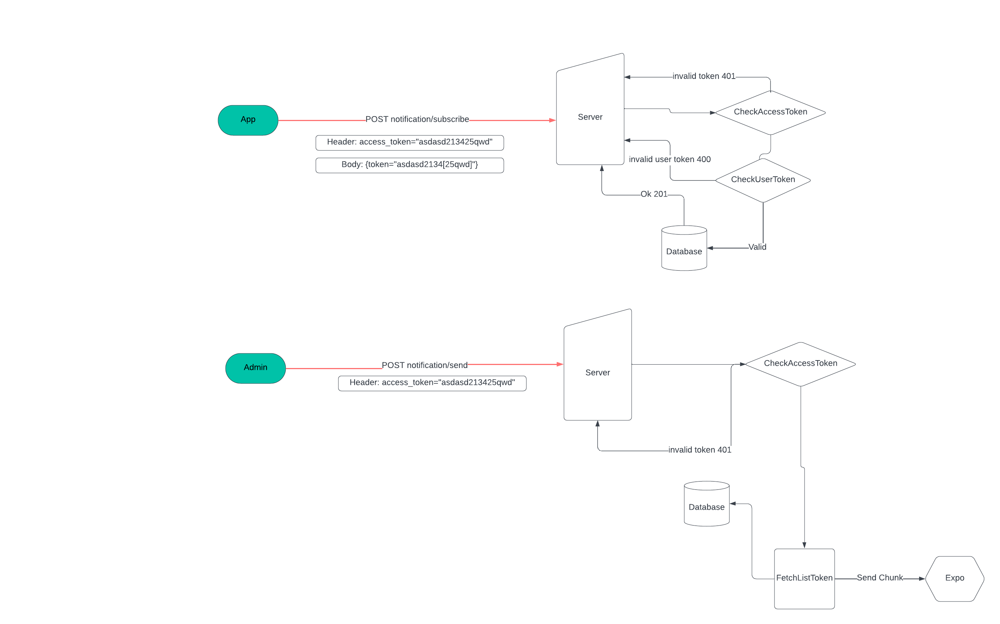

# Explicit Architecture POC

To start your Phoenix server:

- Run `mix setup` to install and setup dependencies
- Start Phoenix endpoint with `mix phx.server` or inside IEx with `iex -S mix phx.server`

Now you can visit [`localhost:4000`](http://localhost:4000) from your browser.

Ready to run in production? Please [check our deployment guides](https://hexdocs.pm/phoenix/deployment.html).

## archtectural concepts from Explicit Architecture

<a href="https://herbertograca.com/2017/11/16/explicit-architecture-01-ddd-hexagonal-onion-clean-cqrs-how-i-put-it-all-together/">

## Workflow



## Resorces

see ./lib/app/notification/notification.md

## Local configs

- 1. Database:
  ```bash
   docker-compose up -d
  ```
- 2. Database

## Reference to build new modules


